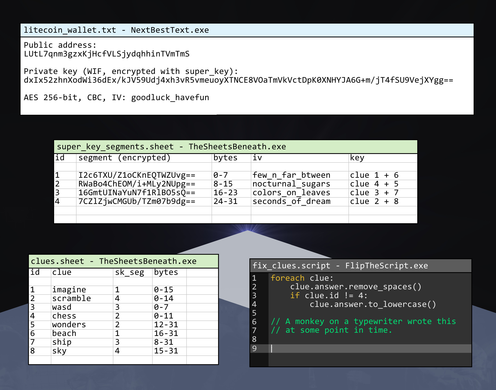

# Path to Greatness: Treasure Hunt (3.02608794 LTC, [OPEN])

Justin Patterson, a solo Unity developer from Duluth, Minnesota, shipped a free demo of his
game in February 2021, hid eight visual riddles in it, and locked a Litecoin wallet behind
them. He announced it on r/ARG on 2021-07-25 and it has been sitting untouched since: eight
incoming payments, nothing spent. What makes it worth picking up is that the author drew his
own encryption on one of the clue images. The key is cut into four independent 8-byte
segments, each one guarded by a two-answer AES-256 lock with a perfect padding test, so any
guess about a pair of clues is settled on its own in microseconds. Four locks, none open yet.

## At a glance

| | |
|---|---|
| Author | Justin Patterson, [jpatt94 on Reddit](https://reddit.com/user/jpatt94) |
| Published | 2021-07-25, r/ARG ([post](https://reddit.com/r/ARG/comments/orgh1k/i_made_a_treasure_hunt_with_a_crypto_prize/)); the site and the game demo went up 2021-02 |
| Prize | 3.02608794 LTC (about $163 at LTC = $54, 2026-08-16; LTC was $54.17 when I read the price on 2026-09-12) |
| Chain | litecoin |
| Escrow | `LUtL7qnm3gzxKjHcfVLSjydqhhinTVmTmS` ([explorer](https://litecoinspace.org/address/LUtL7qnm3gzxKjHcfVLSjydqhhinTVmTmS)) |
| Last on-chain check | 2026-09-12: funded and unspent, 302,608,794 litoshis received over 8 transactions, 0 spent |
| Status | OPEN |
| Puzzle type | raw-private-key, image-stego, audio, text-cipher |
| Target format | Litecoin WIF (version byte 0xB0, so it starts with `T` or `6`), AES-256-CBC encrypted; the 8 answers concatenate to 128 ASCII characters, which are four AES-256 keys |
| Certified oracle | yes: `tools/oracle.py --selftest` (certified against the canonical secp256k1 vectors for private key 1, a second curve implementation, synthetic witnesses on both AES layers, and the author's own arithmetic) |
| What remains | insight: two of the eight answers are read but not written; no compute step is missing |
| Series | none |

## The puzzle as published

Everything the author published is quoted with its date and URL in
[clues/author-posts.md](clues/author-posts.md). The nine clue images are in `clues/`, byte
for byte as the site serves them.

The hunt lives at [p2gtreasure.com](https://p2gtreasure.com/). The rules page says what the
target is and what the status oracle is:

> "The clues above will lead to a Litecoin wallet's private key."

> "If the prize value shown above becomes zero (or close to zero), it means that someone has
> won and the treasure hunt is over."

The older site, still served at `/old/`, adds two lines that shape the work:

> "The first and last steps are the only steps I will ever provide."

> "The green orbs, timer, and lava have no connection to the treasure hunt. They are meant
> only to be fun objectives."

So there will be no further hint, and the game's own objectives are a negative the author
hands over for free.

The prize is a public pot. The rules say "It is not necessary to make a donation in order to
win", and the same page invites donations straight into the prize address, which is why the
escrow has eight incoming transactions and not one.

Eight clues, five of them screenshots of rooms in the game demo, each a picture plus a short
poem. Two more are delivered by QR codes on the site: `qr1.jpg` resolves through
`tinyurl.com/y6c6o3uj` to a Google Drive copy of `Beach.png`, `qr2.jpg` through
`tinyurl.com/y28knqz3` to `Ship.png`. Those two are the only lossless files in the corpus,
and both poems say so in their own way.

The ninth image is the one that gives the game away. `computer_screen.jpg` is a staged
desktop with four windows, and together they are the complete encryption scheme: the
encrypted WIF and its IV, the four segment ciphertexts with their IVs, the pairing of clues
to segments, and the exact length of every answer.



The transcription of all four windows is in [clues/author-posts.md](clues/author-posts.md).

## What is understood

### Mechanism

```
clue answers (8, fixed lengths, 128 characters total)
   |  spaces removed everywhere, lowercased except clue 4
   v
4 AES-256 keys of 32 bytes each = one pair of answers per key
   |  AES-256-CBC decrypt, one 16-byte block each, IV = an album track title
   v
4 segments of 8 bytes  ->  super_key (32 bytes)
   |  AES-256-CBC decrypt of the 64-byte blob, IV = goodluck_havefun
   v
WIF  ->  secp256k1  ->  hash160  ->  base58check with version 0x30
   v
LUtL7qnm3gzxKjHcfVLSjydqhhinTVmTmS
```

The pairing and the lengths, as published:

| Segment | IV | Clues | Lengths |
|---|---|---|---|
| 1 | `few_n_far_btween` | imagine + beach | 16 + 16 |
| 2 | `nocturnal_sugars` | chess + wonders | 12 + 20 |
| 3 | `colors_on_leaves` | wasd + ship | 8 + 24 |
| 4 | `seconds_of_dream` | scramble + sky | 15 + 17 |

This is the selling point of the puzzle, and the reason it is worth a few hours rather than a
few months. It is not one lock with eight unknowns. It is **four locks with two unknowns
each**, and every lock has a perfect test. A segment ciphertext is one AES block holding 8
useful bytes, so its plaintext has to end with a PKCS7 padding of eight `0x08` bytes. A wrong
key produces that by chance with probability 2^-64. A hypothesis about one pair of clues is
therefore confirmed or refuted knowing nothing about the other six answers, in about 3
microseconds on one core.

The four IVs are not decoration either. They are track titles from the author's own album
"Seconds of Dream", whose 57:06 of audio is embedded in the game demo. That album is the
puzzle's dictionary: clue 8 states its rule as `4 -> Exit Light -> T` and
`8 -> Ghost March -> R`, and "Exit Light" and "Ghost March" are tracks 4 and 5 of that album.

### Derivation and oracle

```
python3 tools/oracle.py --selftest                       # must print SELFTEST OK
python3 tools/oracle.py --segment 1 <imagine> <beach>    # one pair, MATCH or NO MATCH
python3 tools/oracle.py --answers <a1> ... <a8>          # all eight, in clue order
python3 tools/oracle.py --stdin-segment 3                # one "wasd ship" pair per line
```

The oracle normalises the answers exactly as the author's `fix_clues.script` states (spaces
removed everywhere, lowercased except clue 4), rejects any answer of the wrong length without
touching AES, decrypts the segment, and accepts only a plaintext ending in eight `0x08`
bytes. `--answers` goes all the way: it rebuilds the 32-byte `super_key`, decrypts the WIF
blob, derives the address, and compares all 34 characters with the escrow. Nothing else is
called a solution. No network, no files read. About 294,000 segment tests per second per CPU
core in Python.

### Certified against

1. The canonical secp256k1 and hash160 vectors for private key 1: compressed
   `1BgGZ9tcN4rm9KBzDn7KprQz87SZ26SAMH`, uncompressed
   `1EHNa6Q4Jz2uvNExL497mE43ikXhwF6kZm`.
2. Eight keys cross-checked between two independent curve implementations (coincurve on
   libsecp256k1, and the pure Python ecdsa package), at head, middle and tail of the set.
3. The Litecoin version bytes and the WIF encoder, cross-checked against a third library.
4. A synthetic witness on the segment layer: a known 8-byte payload is encrypted under a
   known key, re-found through the normal code path, and 1,024 neighbouring keys are all
   rejected. Same protocol on the WIF layer.
5. Three control negatives are rejected, including the escrow address itself passed as a WIF.
6. The author's own arithmetic: the 8 answer lengths sum to 128, every IV is 16 characters,
   every segment ciphertext decodes to 16 bytes, and the WIF blob is 64 bytes, 4 AES blocks.

### Established facts

1. The escrow holds 302,608,794 litoshis, received over 8 transactions, with 0 spent, checked
   on 2026-09-12 against the litecoinspace API. The filter that matters here is
   `spent == 0`, not "one incoming transaction": this is a pot the public tops up.
2. The composition scheme transcribed above is verified against the lossless texture shipped
   inside the game demo, not against the JPEG. Its four segment ciphertexts and the WIF blob
   all pass a free base64 canonicity check: a 16-byte ciphertext ends in `==` and its 22nd
   character carries only 2 useful bits, so it can only be `A`, `Q`, `g` or `w`. All four are
   `g`, `g`, `Q`, `g`. This caught one real misreading: `...s0==` read off the texture is
   structurally invalid, so the character is a `Q`, and `O` against `Q` at that resolution was
   my error, not the author's. The check runs inside `--selftest`.
3. Clue 7's carrier is steganography, and the author says so in the poem ("A red sky at
   night / Not the least bit significant / A channel for light"). Measured on `Ship.png`:
   the image is greyscale, so green equals blue exactly on all 2,073,600 pixels, and
   `R & 0xFE == G & 0xFE` everywhere. The red low bit plane has been rewritten whole. Its
   mean is 0.2502 against 0.5015 for green and blue, and it compresses to 0.114 against
   0.150. Averaged over 3 by 3 blocks it renders a dithered picture, Floyd-Steinberg by row
   (re-dithering reproduces 99.98 percent of it by row against 99.64 percent serpentine).
4. That hidden picture is a montage of frames from the 1997 film "Titanic", the scene where
   Andrews explains on the plans that the ship will founder: J. Bruce Ismay played by
   Jonathan Hyde on the left, Thomas Andrews played by Victor Garber on the right, the deck
   plans in the middle. Confirmed two ways: TinEye queried by URL returns the same frame
   three times, and FaceNet scores the left face at 0.907 and the right at 0.721 against
   frames of the scene, where the calibration is 0.96 to 0.99 for the same still degraded by
   dithering and below 0.5 for a stranger. About 700 photographs of the real 1912 passengers
   and crew were compared first and none passed 0.53. They are actors, not historical
   figures.
5. Clue 6's carrier is audio, not an image. `Beach.png` has no low bit plane signature at all
   (24 bit planes checked in both scan directions, nothing after the IEND chunk, and the sand
   grain co-varies across red, green and blue, which is a drawn texture and not a payload).
   The poem says "Note the first fifteen you hear".
6. The melody of clue 6 is the opening of the author's own YouTube video "Seconds of Dream -
   Path to Greatness Soundtrack" (2019), which is monophonic, one held note at a time, while
   the album version embedded in the game has a median polyphony of 4.78 simultaneous notes.
   Measured to within 1 cent by FFT, the first fifteen notes are A#5 F#5 B5 A#5 F#5 D#5 F5
   C#5 B4 C#5 A#4 A#5 F#5 B5 A#5, key F# major or D# minor. The poem requires the pattern to
   start on `sol`, and in D# minor the first note A# is exactly the fifth degree. This is the
   first reading where that free witness passes without circular reasoning, since the key was
   also obtained independently by Krumhansl profile.
7. The answer to clue 6 is 16 characters for 15 notes, so exactly one note costs two
   characters: either an accidental, or a note outside the octave, or one separator. Note the
   sixth note carries a vibrato between D#5 and E5, and its FFT peak is D#5.
8. Clue 3's grid is drawn, not random. Reading the 10 by 10 grid of number plus direction
   pairs as a pointer graph: 0 cells point outside the grid, the 92 arrow cells form a single
   cycle of length 92, the 4 starred cells are isolated with no predecessor and no successor,
   and there are exactly 8 cells with no predecessor for an 8 character answer. The four stars
   carry the values 1, 2, 3 and 4, which is an explicit order.
9. Clue 5's numbers are presented as distances. Two 64 by 64 textures reading `km` and `mi`
   are placed on the two torches framing the panel in the game level, `km` on the visitor's
   left and `mi` on the right, and each row of the panel ends in a pennant pointing at one of
   them. The values are 12,772 and 5,210 and 12,061.
10. Clue 4 is an encoding of a chess position, not a chess problem. Stockfish 17 at 20
    seconds and multipv 4 finds no forced mate and no unique move, and the position is in no
    database. The board holds 14 pieces for a 12 character answer. The king on b7 is black,
    checked pixel by pixel and again by an automatic per-square scan, so the piece count is
    ordinary and there is no two-white-kings anomaly.
11. Clue 8's length gap is resolved. The string `ehk-bqNEFRUn-` is 13 cells, dashes at
    positions 4 and 13, and the alphabet positions of its 11 letters, written in decimal and
    concatenated, give `58112171456182114`, which is 17 digits, the required length. Reading
    each value as a single index is ruled out by a counting argument: two of the values need a
    title of 18 letters or more and only one such track exists.
12. The album is the dictionary. "Seconds of Dream" was released 2021-01-07 under the author's
    legal name, 13 tracks, and the durations sum to 3,426,218 ms against 3,426,219 ms for the
    audio clip extracted from the game. Track 1 is "Few and Far Between", which is the IV of
    segment 1 and starts at t = 0. Three of the four IVs are tracks on it; `colors_on_leaves`
    is on neither of the author's two albums, which fits clue 7 being an image and not audio.

## What has been tested

Full ledger in [analysis/tested.md](analysis/tested.md), one row per run with its exact
scope. Totals from the two run logs: **5,690,021,893,966 ordered pairs tested across 37
runs, 0 match**, 4.12 hours elapsed on one RTX 5080, every run carrying witnesses at head,
middle and tail. Nothing here is a compute shortfall; each family was picked by a reading of
a clue, and the reading is what failed.

| Hypothesis | Space | Method | Result | Witness | Date |
|---|---|---|---|---|---|
| Segment 1: `imagine` is one 8-digit block written twice, against every reading of the clue 6 melody and the earlier candidate lists | 3,167,259,234,404 ordered pairs over 24 runs (10^8 digit blocks, 7,124,619 two-format dates, 5,796,056 December date pairs, 319,545 dates in words, against 389 to 13,215 melody readings) | GPU AES-256-CBC padding oracle, each hit re-derived on CPU | 0 match | yes: 3 of 3 planted pairs re-found on every run | 2026-09-09 |
| Segment 3: `ship` is a string taken from the Titanic scene (a line, a name, an actor, a deck, the stanza 2 riddle), against enumerable `wasd` | 1,808,032,432,210 ordered pairs over 10 runs (14,706 word-start windows of the full transcript, 839,858 name and role concatenations, 72,865 screenplay and wiki windows, 3,173,842 deck-name chains, against 10^8 digit strings, all 65,536 `{w,a,s,d}^8`, and 1,134 structural readings) | same GPU oracle | 0 match | yes: 3 of 3 per run | 2026-09-09 |
| Segment 4: `scramble` read mechanically from the 41-character string, against `sky` with capitals pinned | 714,683,191,192 ordered pairs over 2 runs (198,508 scramble readings against 3,599,533 pinned-capital `sky` values and 741 other `sky` families) | same GPU oracle | 0 match | yes: 3 of 3 per run | 2026-09-09 |
| Segment 2: `chess` as 4 pieces in algebraic notation, against the structured `wonders` encodings | 47,036,160 ordered pairs (360 chess readings against 130,656 wonders values) | same GPU oracle | 0 match | yes: 3 of 3 | 2026-09-09 |
| Segment 2, earlier pass: `chess` is the 14 pieces minus exactly 2, in 6 notations and 18 orders, case inverted included | 861,000,000 ordered pairs | CPU harness, exhaustive over the reduction, crossed with the structured `wonders` encodings | 0 match | yes | 2026-09-08 |
| Segment 3, earlier pass: `wasd` is the four movement letters, against the first `ship` family | 10,900,000,000 ordered pairs (all 65,536 `{w,a,s,d}^8` against 174 tokens concatenated 1 to 3 deep) | CPU harness | 0 match | yes | 2026-09-08 |
| Clue 6 melody is a well-known tune (Do-Re-Mi, the Lost theme, Zelda, Mario, Tetris, Star Wars and 14 others) | 840 encodings over 20 tunes | arithmetic filter only: 18 of the 20 cannot produce 16 characters for 15 notes under any encoding | 18 of 20 excluded without calling the oracle | not applicable, this is a free filter | 2026-09-08 |
| The hidden image of `Ship.png` comes from a texture inside the game | 198 extracted textures, SSIM and correlation, mirrored and not | image comparison | best real score 0.106 | yes: planted copy scores 1.000 | 2026-09-08 |
| The two faces are real Titanic passengers or crew | about 700 targeted photographs, including the 206 portrait plates of the 1911 source volume | SSIM then FaceNet | best real score 0.76, later explained: they are actors | yes: witnesses score 0.92 to 0.99 | 2026-09-09 |
| `ship` is a string written inside the hidden image | not a count: a legibility witness | 24 characters planted at the real size and the real contrast are re-read, even at 61 percent of it; nothing comparable is present | the image carries a picture, not text | yes | 2026-09-08 |
| `Beach.png` carries image steganography | 24 bit planes in 2 scan directions, local contrast at 6, 12 and 25 times, bytes after IEND | pixel analysis | nothing, and the carrier is audio | yes | 2026-09-08 |
| Segment 4, wave F | 6,110,000,000 ordered pairs | CPU harness | exit code 0 but no verdict line was written | **uncertified, does not count** | 2026-09-08 |

## Open leads, ranked

Full notes in [analysis/leads.md](analysis/leads.md).

1. **Segment 1: the 16th character, and how `imagine` is written** (minutes per new reading).
   The melody is measured and the key witness passes for the first time, so the notes are
   almost certainly right and the writing convention is not. Two unknowns are left: which of
   the 15 notes costs two characters (the sixth note bends between D#5 and E5), and what the
   clue 1 poem wants written twice. Every new convention costs 0.2 seconds against all 10^8
   repeated 8-digit blocks, which is exhaustive over dates in any format. What would confirm
   it: a match on segment 1. What would kill the current framing: listening to the video and
   counting a number of notes other than 15.
2. **Segment 1, the other half: `imagine` may not be a date at all** (minutes). The poem says
   "Left a number in its place", and the rewritten lyric is the substitution it points at,
   "Livin' life today" where Lennon wrote "living life in peace". The replaced word may be
   what the number stands for. Every calendar date pair has been swept already, so this is the
   reading that is left.
3. **Segment 3: what the author would write to describe his own montage** (minutes per
   family). Lines, names, actors, decks and the stanza 2 riddle are all refuted against an
   enumerable left half. What has not been tried is a plain description of what the picture
   shows rather than a quotation from the film. The left half stays free: `{0-9}^8` is 19
   seconds and `{0-9wasd}^8` is 1.5 seconds on the GPU engine, so one `ship` hypothesis is
   tested alone.
4. **Segment 4: the pairing rule between the 17 digits and the 13 tracks** (hours). The rule
   is certified by the author's own two examples, and a lowercase form reproduces one of them
   and closes the count at 17 characters whose letters start `e n t ? r`, which reads as
   ENTER, and "Exit light, enter night" is a Metallica lyric the author is quoting. The block
   is that track 7, `allartmustdie`, contains neither `h` nor `n`, so `enterthenight` cannot
   come out of a positional 1 to 13 pairing. What would confirm it: a pairing that is not
   positional and still reproduces `4 -> Exit Light -> T`.
5. **Segment 2: identify the six pictograms of clue 5** (needs a person). The three numbers
   are framed as distances by the `km` and `mi` textures, but 12,772 miles is more than half
   the Earth's circumference, and a haversine sweep over the New7Wonders plus Giza plus 21
   monuments in both units, tolerance 60, produced no coincidence under 6 miles. If the
   numbers are instead track and letter indexes, as clue 8's certified rule suggests, then
   naming the icons is what unlocks the reading. Someone who recognises the drawings settles
   this in a minute.

## Files in this folder

| Path | What it is |
|---|---|
| `clues/computer_screen.jpg` | the author's fake desktop: the whole encryption scheme, as served by the site |
| `clues/clue1_imagine.jpg` | clue 1, 16 characters, the rewritten Lennon poem and the number 19410712 |
| `clues/clue2_scramble.jpg` | clue 2, 15 characters, eight anagrams over a 41-character mixed-case string |
| `clues/clue3_wasd.jpg` | clue 3, 8 characters, the 10 by 10 pointer grid with four numbered stars |
| `clues/clue4_chess.jpg` | clue 4, 12 characters, the only answer that keeps its case |
| `clues/clue5_wonders.jpg` | clue 5, 20 characters, three rows of pictograms and vinculum Roman numerals |
| `clues/00111111.jpg` | clue 8, 17 characters, the rule panel and the string `ehk-bqNEFRUn-` |
| `clues/qr1.jpg`, `clues/qr2.jpg` | the two QR codes on the site, which resolve to the two lossless carriers |
| `clues/Beach.png` | clue 6 carrier, 412 by 312, delivered by QR1; the poem points at audio |
| `clues/Ship.png` | clue 7 carrier, 1920 by 1080, delivered by QR2; the red low bit plane is rewritten |
| `clues/treasure_chest.png` | the site banner, included for completeness |
| `clues/author-posts.md` | the announcement, both rules pages, the composition scheme, the clue poems, with URLs and dates |
| `analysis/tested.md` | the negatives ledger, one row per run, with scope, witness and rate |
| `analysis/leads.md` | full notes behind the ranked leads |
| `tools/oracle.py` | the checker: one pair per segment, or all eight answers to the address; `--selftest` |

## Sources

- Announcement, r/ARG, 2021-07-25: https://reddit.com/r/ARG/comments/orgh1k/i_made_a_treasure_hunt_with_a_crypto_prize/
- Puzzle site, read 2026-09-09: https://p2gtreasure.com/ (archived: https://web.archive.org/web/20211220074516/http://p2gtreasure.com/)
- Older site and its rules page, still served: https://p2gtreasure.com/old/index.html (archived: https://web.archive.org/web/20220323235950/http://p2gtreasure.com/old/index.html)
- Clue images, as served since 2021-05-15 (archived 2022): https://web.archive.org/web/20220420084754/http://p2gtreasure.com/Clues/computer_screen.jpg
- Escrow, checked 2026-09-12: https://litecoinspace.org/address/LUtL7qnm3gzxKjHcfVLSjydqhhinTVmTmS
- Game demo, Unity Windows build of 2021-02-04, linked from the old download page: https://drive.google.com/file/d/15B7i1EU7OUpc1SXYmSccRLDku4199cSB/view
- Demo trailer, YouTube: https://www.youtube.com/watch?v=T98D6Otefgs
- "Seconds of Dream - Path to Greatness Soundtrack", YouTube, 2019-03-18, the monophonic opening: https://www.youtube.com/watch?v=EojQgdZeTyM
- Album "Seconds of Dream", Justin Patterson, 2021-01-07, 13 tracks: https://open.spotify.com/album/1pGpPWw8Dl0Uq7n77s4koK
- Album tracklist with durations, iTunes: https://music.apple.com/us/album/seconds-of-dream/1548289299
