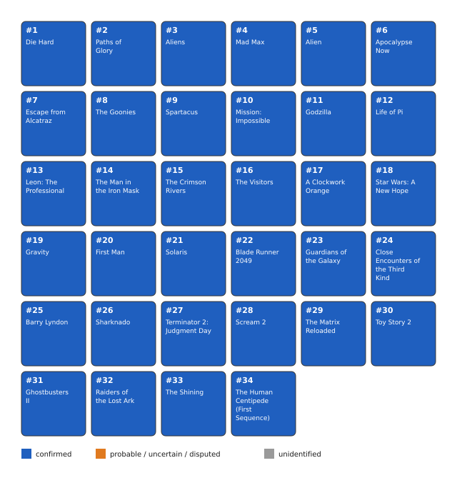

# Bitcoin Movie Enigma (100,000 sats, [SOLVED])

A solution was verified locally on 2026-09-07: the recovered 24-word phrase
derives the exact funded address at `m/84'/0'/0'/0/0`. An independent manual
BIP32 implementation reproduced the address, and an offline signature proves
control of its key. Solver rabbidbird claimed 99,766 sats after a 234-sat fee;
the payout is confirmed in block 965998. The prize address is now swept.

The phrase uses English BIP39 words but fails the BIP39 checksum. The former
oracle discarded it before derivation. The corrected oracle accepts 24 listed
words and derives their seed directly. The full solution is disclosed below
now that the prize has been claimed.

## At a glance

| | |
|---|---|
| Author | klems, originally X @cryptop1r4t3 |
| Published | 2022-04-08 on X; relaunched on Nostr 2024-01-03 |
| Prize | 100,000 sats |
| Chain | bitcoin |
| Escrow | `bc1q94ecsn0qk8lap2gefrycnms3ruepy889z969a6` ([explorer](https://mempool.space/address/bc1q94ecsn0qk8lap2gefrycnms3ruepy889z969a6)) |
| Last on-chain check | 2026-09-07: payout confirmed in block 965998; escrow swept |
| Status | SOLVED; 99,766 sats paid out after a 234-sat fee |
| Target format | 24 English BIP39-listed words, invalid checksum, empty passphrase |
| Matching derivation | BIP39 seed algorithm, BIP84 `m/84'/0'/0'/0/0` |
| Certified oracle | `tools/oracle.py --selftest`, including invalid-checksum regression |
| What remains | Nothing; solution and confirmed payout recorded |
| Series | none |

## The puzzle as published

The [author's rules](https://bitcoinmovieenigma.com/rules) require identifying
34 film stills, converting their titles into English seed words, and removing
ten intruders using metadata on the films' IMDb pages. The remaining words stay
in panel order. The Nostr launch note names director, release year, runtime and
cast as useful fields.

The site displays synthetic dates on its frame pages. Those dates are not the
publication chronology. The April 2022 funding coincides with the original X
release; January 2024 was a relaunch. The alternative release is the same 34
frames displayed together. Film stills are linked rather than reproduced.

## What is understood

All 34 film identifications have been reconciled with the current community
list. In particular, panel 11 is Godzilla (1998), panel 14 is The Man in the Iron
Mask (1998), and panel 34 is The Human Centipede (First Sequence). Older notes
below are historical and contain superseded identifications.

The positive evidence is in
[analysis/solution-verification-2026-09-07.json](analysis/solution-verification-2026-09-07.json).
It contains the matching address and path, checksum bytes, an independently
verified public-key signature, and the unspent output. It contains no mnemonic
or private key. The signature is an offline proof, not a spending transaction.

The checksum encoded by the phrase is 47; the checksum expected from its entropy
is 119. PBKDF2 still derives a seed from that phrase. A wallet that enforces
valid BIP39 checksums may reject it, so use the corrected checker to verify
recovery input before attempting an import.

```
python tools/oracle.py --selftest
python tools/oracle.py --stdin
```

The self-test checks the standard 12-word BIP84 vector and exact independently
calculated addresses for valid and invalid 24-word examples. It also exercises
the checker against the invalid-checksum example, preventing the original
false-negative filter from returning.


*Figure 1. Film identification state; source: data/films.csv; generator:
tools/fig_panel_grid.py; updated 2026-09-07. No film stills reproduced.*

## What has been tested

[analysis/tested.md](analysis/tested.md) preserves the earlier community research.
Those searches only cover their declared word pools and derivation filters.
Checksum-filtered searches do not rule out this solution, which fails the
checksum and was found by a direct title reading. The positive address match
and the confirmed spend settle the solution.

The final phrase matched the escrow using both the corrected oracle and a
separate manual derivation. The user-broadcast [payout transaction](https://mempool.space/tx/bd3b088164ae32458b97b917af8fab14056461c5e954499f7bd4cf3a67d6c5f4)
spends the matching output; see
[the payout verification](analysis/payout-verification-2026-09-07.json).
The actual amount and fee supersede the earlier unsigned draft.

## Open leads, ranked

None; the solution is verified and the payout is confirmed.

## Solution

Solved and claimed by [rabbidbird](https://github.com/rabbidbird), with the film
identifications and source reconciliation contributed in [issue #9](https://github.com/floflo777/open-crypto-puzzles/issues/9).

The films form five thematic groups. Removing two outliers from each group
gives exactly ten intruders:

| Group | Panels | Shared property | Removed panels |
|---|---|---|---|
| Director | 1, 2, 9, 17, 25, 33, 34 | Stanley Kubrick | 1, 34 |
| Year | 3 through 8 | Released in 1979 | 3, 8 |
| Cast | 10 through 16 | Jean Reno appears | 12, 14 |
| Runtime | 18 through 24 | At least two hours | 19, 21 |
| Installment | 26 through 32 | Second film in its series | 26, 32 |

Read the retained titles in their original panel order. Remove a leading
article (A or The), then match the title's opening prefix to a BIP39 word.
Use four letters where they identify a word; otherwise use the uniquely
identifying three-letter prefix. This supplies the exact recovered phrase:

```
path mad alien apology escape spare miss goddess leopard crime visit clock start first blade guard close barrel term screen matrix toy ghost shine
```

| Panel | Film | Seed word |
|---|---|---|
| 2 | Paths of Glory | `path` |
| 4 | Mad Max | `mad` |
| 5 | Alien | `alien` |
| 6 | Apocalypse Now | `apology` |
| 7 | Escape from Alcatraz | `escape` |
| 9 | Spartacus | `spare` |
| 10 | M:I (1996), opening word `Mission` | `miss` |
| 11 | Godzilla | `goddess` |
| 13 | Leon: The Professional | `leopard` |
| 15 | The Crimson Rivers | `crime` |
| 16 | The Visitors | `visit` |
| 17 | A Clockwork Orange | `clock` |
| 18 | Star Wars: A New Hope | `start` |
| 20 | First Man | `first` |
| 22 | Blade Runner 2049 | `blade` |
| 23 | Guardians of the Galaxy | `guard` |
| 24 | Close Encounters of the Third Kind | `close` |
| 25 | Barry Lyndon | `barrel` |
| 27 | Terminator 2: Judgment Day | `term` |
| 28 | Scream 2 | `screen` |
| 29 | The Matrix Reloaded | `matrix` |
| 30 | Toy Story 2 | `toy` |
| 31 | Ghostbusters II | `ghost` |
| 33 | The Shining | `shine` |

The encoded checksum byte is 47, while SHA256 of the encoded entropy requires
119. Do not repair the last word: doing so changes the key. Instead apply
PBKDF2-HMAC-SHA512 to the phrase with salt `mnemonic`, 2048 iterations and an
empty passphrase, then derive `m/84'/0'/0'/0/0`. This yields the published escrow
address exactly. Both bip_utils and an independent manual BIP32/Bech32
implementation reproduced it.

The [confirmed payout](https://mempool.space/tx/bd3b088164ae32458b97b917af8fab14056461c5e954499f7bd4cf3a67d6c5f4) spends funding transaction
`b8058e6f373096445e4c5072f163e9e24727a3f622e0135150a88d25e4fdb2a3`, output 4,
and pays 99,766 sats to `35h2x1Rqq3HmV1NX4KQAGZoz8Vmf42ktQT`. The fee is 234 sats.
The input witness public key is the same key independently derived above.
Confirmation block: 965998 (2026-09-08 UTC, 2026-09-07 America/New_York).

## Files in this folder

| Path | What it is |
|---|---|
| `clues/author-posts.md` | Historical author-source notes |
| `data/films.csv` | Reconciled 34-film identification list |
| `data/solution.json` | Exact recovered phrase, title mapping and confirmed payout |
| `analysis/tested.md` | Search ledger and scope limitations |
| `analysis/solution-verification-2026-09-07.json` | Public verification evidence, no recovery secrets |
| `analysis/payout-verification-2026-09-07.json` | User payout, actual amount/fee, independent explorer checks |
| `analysis/leads.md` | Earlier leads, superseded by the local solution |
| `tools/oracle.py` | Candidate verifier that permits invalid BIP39 checksums |
| `tools/fig_panel_grid.py` | Identification figure generator |

## Sources

- [Author's rules](https://bitcoinmovieenigma.com/rules)
- [Author's wallet page](https://bitcoinmovieenigma.com/wallet)
- [Nostr relaunch note](https://njump.me/48fbbff9845680b463784d5ddfdc5907a953b3f4df9e0e49a97d6eb123d52145)
- [Community film reconciliation and research](https://github.com/floflo777/open-crypto-puzzles/issues/9)
- [Escrow address](https://mempool.space/address/bc1q94ecsn0qk8lap2gefrycnms3ruepy889z969a6)

- [User payout transaction](https://mempool.space/tx/bd3b088164ae32458b97b917af8fab14056461c5e954499f7bd4cf3a67d6c5f4)
