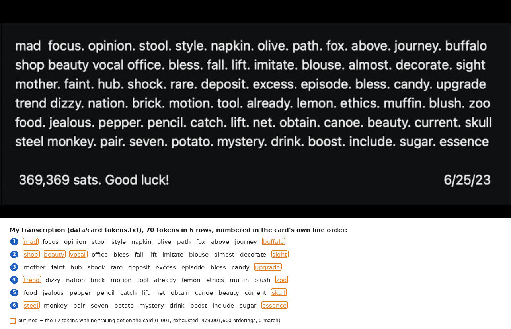
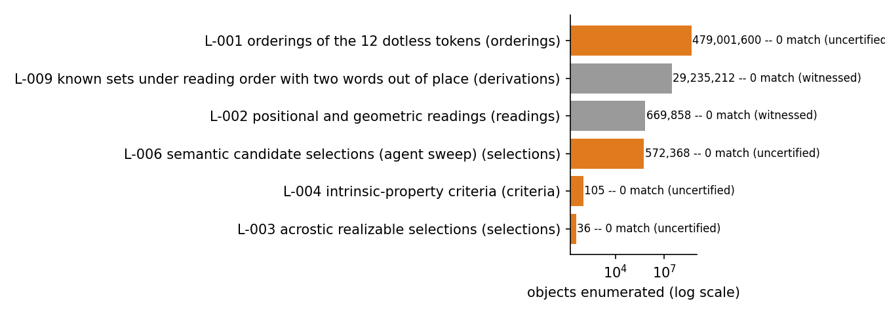

# Keysa: Crack the Seed Game (369,369 sats, [DEAD END])

**Swept on 2026-09-08.** The escrow was emptied in block 966,260 by
[transaction d072de42](https://mempool.space/tx/d072de42a72e5dd75f5eb4776f32eb26727ce37c5f7d54ee94c74347ed4eb2d7),
369,150 sats to `bc1q82gz5dnpxnqmvzrkusm8yc0nt4dcqp8gd3y59j`, a plain P2WPKH spend with no
message. The author confirmed the crack on X on 2026-09-10
([thread](https://x.com/SimplestBTCBook/status/2098130640528925162)): the seed was 12 words
generated by BlueWallet and hidden among the 70 printed words, and she congratulated "the
person who got their AI to grind hard enough" without naming them. Nobody has published the
12 words or the selection rule as of 2026-09-12. The research below is kept as it stood; if
the solver reads this, an issue with the derivation gets full credit here.


Keysa, a Bitcoin educator and author of "The Simplest Bitcoin Book Ever Written,"
posted a puzzle card on X and Nostr on 2023-06-26: 70 printed words, 12 of which are
the real 12-word seed for a wallet she funded with 369,369 sats. She never published
the wallet's address; I found it by matching the announced amount against a full
blockchain balance dump, corroborated by the wallet's script type and by the funding
transaction landing 2 minutes 28 seconds after her post. The escrow is still funded
and unspent 3 years later. The derivation (12 words in the right order to a BIP84
address) is fully understood and certified. What is missing is the selection rule
that picks 12 words out of 70: I have exhausted every mechanical and positional
reading I could enumerate, all negative, and the author's own words point toward a
short, spoken rule rather than a hidden calculation. Her replies of 2023-06-27, which
I only read on 2026-08-16, settle the order: the 12 words sit on the card in seed order
except for two, so the whole puzzle is the selection.

## At a glance

| | |
|---|---|
| Author | Keysa, [@SimplestBTCBook on X](https://x.com/SimplestBTCBook) |
| Published | 2023-06-26, X and Nostr ([original post](https://x.com/SimplestBTCBook/status/1673197111603519490)) |
| Prize | 369,369 sats (about $233 at BTC = $63,000, 2026-08-16) |
| Chain | bitcoin |
| Escrow | `bc1qcv84707v4sglaj306qezkcrun4eejh77k8cyjr` ([explorer](https://mempool.space/address/bc1qcv84707v4sglaj306qezkcrun4eejh77k8cyjr)) |
| Last on-chain check | 2026-09-12: swept, 0 sats; 369,150 sats left in block 966,260 on 2026-09-08 |
| Status | SWEPT BY A THIRD PARTY, solver and solution unpublished |
| Puzzle type | bip39-seed, word-selection |
| Target format | BIP39 12 words (English), BIP84 `m/84'/0'/0'/0/0`, no passphrase |
| Certified oracle | yes: `tools/oracle.py --selftest` (certified against the public BIP39/BIP84 test vector) |
| What remains | the selection rule that picks 12 of the 70 printed words; the derivation itself is solved |
| Series | none |

## Why this is a dead end

Swept by a third party on 2026-09-08 (block 966,260). The prize is gone and the solver has not
published the derivation. Reusable: the author's clues were exactly two, "12 words" and "all
but two in order", and the seed came from BlueWallet (a checksum-valid mnemonic), so every
checksum-filtered negative in `analysis/tested.md` stands as a true negative on the
selection rule. If the derivation surfaces, this folder moves to the solved tier with credit.

## The puzzle as published

Keysa posted two images on 2023-06-26: a ciphertext card with 70 words
(`clues/L9rQ.jpg`) and a balance-proof card showing the wallet total
(`clues/qYkB.jpg`). Her original caption included the rule: 12 of the 70 words form
the real seed, and "you can ignore the dots." Twenty-five minutes later she
clarified an earlier remark: "The only hint is that it's a 12 word seed," meaning 12
words rather than 24, not "this puzzle among several of mine."

In later posts she added detail without giving the rule away. On 2024-11-12: "a good
way to travel with your seed... you need an unforgettable way to decipher it," and,
describing how she shares a copy with a trusted person, "telling them the decryption
cipher as well." She also stated the dots on the card are "random, can ignore," and
that the wallet was generated by BlueWallet rather than by manual dice rolls
("I've never rolled 12 words," 2025-03-05). As late as 2024-11-12 she confirmed the
prize was still unclaimed: "many tried but so far the sats are still there." Short,
dated quotes with links are in [clues/author-posts.md](clues/author-posts.md).

Two replies she posted on 2023-06-27, two levels down in the thread under her original
post, carry the one order statement she has made. At 13:24 UTC: "in this example one
still wouldn't know which of all those words are the 12 words in the seed phrase
right?" At 13:32 UTC: "In this example, all the words but two, are in order ;)". The
same afternoon she added that the 58 decoys are BIP39 words "because the anon set
would decrease if one includes words not on the list". I read these on 2026-08-16;
every sweep before that date had assumed either the card order, its reverse, or an
arbitrary order, and none had tested a reading order with two words out of place.


*Figure 1. The published card and my transcription of its 70 tokens, with the 12 dotless tokens outlined (source: data/card-tokens.txt, script tools/fig_card_grid.py), 2026-08-16.*

## What is understood

### Mechanism

The card shows 70 tokens across 6 rows of 12, 12, 11, 12, 12, and 11 tokens (70
total, 67 distinct: `bless`, `lift`, and `beauty` each appear twice). All 70 tokens
are valid BIP39 English words. Twelve of them, in some order, form the real seed.
Selecting the 12 words in the correct order, deriving the BIP39 seed with an empty
passphrase, and deriving the BIP84 first receiving address (`m/84'/0'/0'/0/0`) must
reproduce the escrow address. The address's script type, `v0_p2wpkh`, matches BIP84,
and the balance-proof card is a BlueWallet screenshot, whose default HD path is also
BIP84: two independent signals agreeing on the derivation path.

Because every one of the 70 tokens is a valid BIP39 word, the checksum can never be
used to rule a selection in or out: a random 12-word draw from this specific set of
70 already passes the checksum about 1 time in 16, the same rate as for any 12
words. Every hypothesis in this folder was checked against the actual target
address, never filtered by checksum alone.

### Derivation and oracle

```
python3 tools/oracle.py --selftest
python3 tools/oracle.py "w1 w2 w3 w4 w5 w6 w7 w8 w9 w10 w11 w12"
```

The oracle validates the 12-word candidate as a BIP39 mnemonic (word count and
checksum), derives the BIP84 first receiving address, and compares it byte-exact to
the escrow address. `MATCH <address>` on a hit, `NO MATCH` otherwise (including when
the candidate fails BIP39 validation, since no address can be derived from it).
Exit code 0 or 1.

### Certified against

No solved sibling exists for this puzzle, so `tools/oracle.py --selftest` certifies
the derivation path against the public BIP39/BIP84 test vector: the mnemonic
"abandon" repeated 11 times plus "about" derives address
`bc1qcr8te4kr609gcawutmrza0j4xv80jy8z306fyu`, the standard published value for this
vector. The selftest also checks that a broken checksum and a wrong word count are
both correctly rejected. Reproduced 2026-08-16.

### Established facts

1. The escrow is funded and unspent as of 2026-08-16 (checked via
   [mempool.space](https://mempool.space)), 3 years after publication.
2. The author never published the escrow address; I identified it by matching the
   announced amount, 369,369 sats, against a full blockchain balance dump, then
   confirmed it by script type (`v0_p2wpkh`, matching BIP84) and by the funding
   transaction confirming 2 minutes 28 seconds after her original post.
3. The card transcribes to exactly 70 tokens in 6 rows of 12/12/11/12/12/11, 67
   distinct words, all valid BIP39 English words (`data/card-tokens.txt`).
4. The 6 rows are typed line breaks, not a display-width artifact: a narrower-column
   screenshot of the same note shows the rows wrapping with far more leftover space
   than an automatic reflow would leave (`analysis/tested.md`).
5. Exactly 12 of the 70 tokens carry no trailing dot on the card; this cardinality
   matches the target selection size exactly, though the author has twice stated the
   dots are random.
6. The checksum passes at the expected background rate (about 1 in 16) across every
   sweep run against this token set, confirming no bias in the derivation pipeline
   and confirming the checksum cannot discriminate a correct selection here.
7. The order of the seed is the card's reading order of the 12 selected tokens, except
   for two words (Keysa, 2023-06-27, `clues/author-posts.md`). That replaces 12! orders
   per candidate set by 67 (reading order plus one transposition) or about 6,100
   (reading order with up to two words moved), and puts the whole difficulty on the
   selection.

## What has been tested

Full ledger in [analysis/tested.md](analysis/tested.md). Summary:

| Hypothesis | Space | Method | Result | Witness | Date |
|---|---|---|---|---|---|
| All orderings of the 12 dotless tokens (L-001) | 479,001,600 orderings | exhaustive 12! permutation, BIP84 derive and compare | 0 match | uncertified: exhaustive but predates the witness protocol | 2026-08-02 |
| Positional and geometric readings (L-002) | 669,858 readings | periodic, self-referential, staircase, diagonal, mirrored, digit-based and punctuation-based families | 0 match | yes: known-good reading planted and recovered | 2026-08-02 |
| Semantic and mnemonic candidate selections (L-006) | 572,368 selections (439,773 distinct sets) | agent-driven candidate proposals under 114 labeled families, checked against the oracle | 0 match | uncertified: no single search order to plant a witness in | 2026-08-02 |
| Intrinsic token properties, including 3-6-9 digital roots (L-004) | 105 criteria | test whether any criterion partitions the 70 tokens into exactly 12 | no criterion reaches 12 (closest: 11 or 13) | uncertified: structural computation, not an oracle sweep | 2026-08-02 |
| Acrostic (initials spell a word) (L-003) | 1,723 composable 12-letter words | subsequence test against the 70 initials | 36 realizable, 0 match | uncertified: self-tested but no formal witness | 2026-08-02 |
| Every candidate set proposed so far (2,084,778 distinct sets: the positional rules, 8 further positional families, the natural sets, and the whole L-006 agent wave) under reading order plus one transposition, 67 orders each (L-009) | 139,680,327 sequences, 8,730,698 checksum-valid | BIP84 derive and compare | 0 match | yes: 3 synthetic sets with a pre-derived target planted at head, middle and tail, recovered | 2026-08-16 |
| The 31,088 natural sets (rows, row edges, dotless tokens, windows, column pairs, sub-grids, progressions) under reading order with up to 2 words moved anywhere, about 6,100 orders each (L-009) | 188,500,763 sequences, 11,775,450 checksum-valid | BIP84 derive and compare | 0 match | yes | 2026-08-16 |
| The same 2,084,778 sets under reversed reading order plus one transposition (L-009) | 139,680,327 sequences, 8,729,064 checksum-valid | BIP84 derive and compare | 0 match | yes | 2026-08-16 |

Cumulative: about 480 million objects enumerated across 5 families through 2026-08-02
(mixed units: orderings, readings, selections, criteria, acrostic candidates), plus
468 million ordered sequences and 29.2 million checksum-valid derivations on
2026-08-16 under the two-words-out-of-order model, 0 matches. Under that model every
candidate set this folder has ever produced is negative; the selection rule is not
in any family formulated so far.


*Figure 2. Coverage of the 6 tested hypothesis families, sized by objects enumerated and colored by witness status (source: data/coverage.csv, script tools/fig_coverage.py), 2026-09-03.*

## Open leads, ranked

1. **Write to the author** (needs a person). Keysa is active and has twice invited
   exactly this: "I would love to know if this method is solid" and "Open to
   comments." Two precise questions now exist: are the two out-of-order words swapped
   with each other, or each moved somewhere else on the card; and does the "cipher"
   she tells a trusted person describe positions on the card or the meaning of the
   words.
2. **A new selection family, replayed under the two-words-out-of-order model**
   (minutes on a CPU). Every set proposed so far, 2,084,778 distinct sets, is negative
   under reading order plus one transposition, and the 31,088 natural sets under up
   to two moved words. Any new family of candidate sets costs milliseconds per set to
   replay; the whole cost is in proposing sets the card supports.
3. **The double-width gap after "mad," and the "369 clock" theme** (needs new
   information). The gap is the only typographic anomaly on the card and is what a
   cut-and-paste that moved two words would leave; no selector has come out of either
   observation.
4. **Two tokens per row, under the corrected order model** (days on a rented GPU; not
   proposed as is). The row family is legitimate (the 6 rows are typed), but 5.7e10
   sets times 67 orders is about 2.4e11 derivations after the checksum filter, about
   3.5 days at 790,000 derivations/s, and the author's words argue for a rule on the
   selection rather than a blind row sweep. It needs a row rule first.

## Files in this folder

| Path | What it is |
|---|---|
| `clues/L9rQ.jpg` | the ciphertext card as published, byte-exact from nostr.build |
| `clues/qYkB.jpg` | the balance-proof card as published, byte-exact from nostr.build |
| `clues/author-posts.md` | dated quotes from Keysa's public posts, with links |
| `data/card-tokens.txt` | my transcription of the 70-token card, 6 rows, dots marked |
| `data/coverage.csv` | counts and witness status for the 5 tested hypothesis families |
| `analysis/tested.md` | the complete negatives ledger |
| `analysis/leads.md` | full notes behind the 4 ranked leads |
| `images/01-annotated-card-grid.png` | the published card plus a rendered transcription with dotless tokens outlined |
| `images/02-coverage-tested-space.png` | coverage bar chart of the 5 tested hypothesis families |
| `tools/oracle.py` | candidate checker, certified against the public BIP39/BIP84 test vector |
| `tools/fig_card_grid.py` | generates images/01-annotated-card-grid.png from clues/L9rQ.jpg and data/card-tokens.txt |
| `tools/fig_coverage.py` | generates images/02-coverage-tested-space.png from data/coverage.csv |

## Sources

- Keysa, original announcement, X, 2023-06-26: https://x.com/SimplestBTCBook/status/1673197111603519490
- Keysa on Nostr: https://njump.me/npub1dpna3xwwddnhhzg9ycpvlcz2ze0jdwm2rf3eqd2lf9leaewtq7tqhw0ef2
- Keysa, reply "all the words but two, are in order", X, 2023-06-27: https://x.com/SimplestBTCBook/status/1673685712498049025
- Keysa, reply "one still wouldn't know which of all those words are the 12", X, 2023-06-27: https://x.com/SimplestBTCBook/status/1673683632546873344
- Keysa, reply "these are all BIP 39 words, because the anon set would decrease", X, 2023-06-27: https://x.com/SimplestBTCBook/status/1673720563318112256
- "The Simplest Bitcoin Book Ever Written," Keysa: https://simplestbitcoinbook.com
